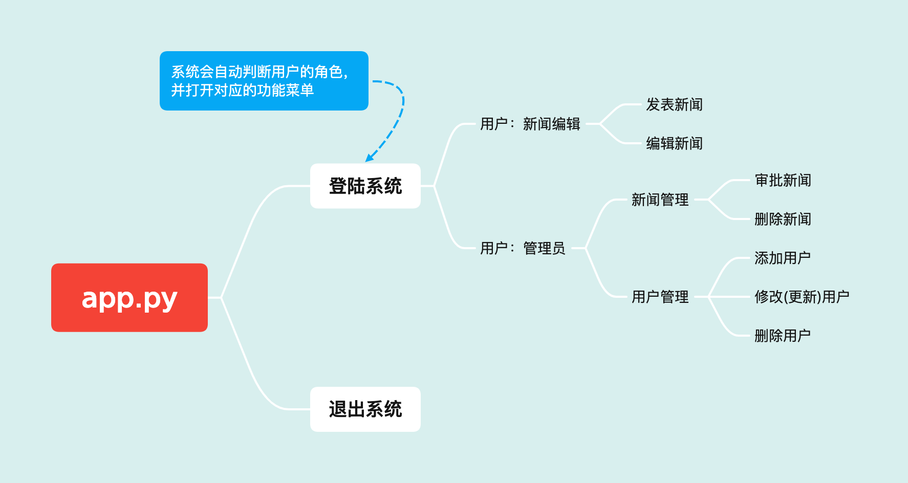

# Python with DBs 新闻管理系统设计

------

## 快速开始 Quick Start Guide

> 首先请确保电脑上安装有MySQL (版本8.0)，Redis (版本6.2) 以及MongoDB (版本Community@5.0)

将项目clone到硬盘之后，使用终端切换到项目根目录下，运行`python3 app.py`即可。

------

## 系统要求

代码基于`Python 3.9.7`，操作系统MacOS

## 使用的数据库

- MySQL (用于保存高价值的关系型数据)
- Redis (用于缓存热点新闻与实时新闻)
- MongoDB (用于保存新闻正文)

## 软件包依赖

首先，电脑需要安装python用于操作mysql的包，可以在终端运行 `pip install mysql-connector-python` 来安装。其次，项目中需要对termial的输出进行颜色的自定义，我们需要colorama包来指定终端内打印文字的颜色。这可以通过 `pip install colorama` 来安装

对于操作redis，我们可以运行`pip install redis`来安装对于应的库。

对于操作mongoDB，我们可以运行`pip install pymongo`来安装对应的库。

## 项目架构和文件目录

项目名称叫做Vega，目标是通过termial来操作一个新闻管理系统。在这个系统中使用MySQL数据库来存储用户、新闻等相关信息。根目录 `/vega `下包含两个文件夹，一个是 `/db` 用于存放数据库操作相关的文件，另一个是 `/service` 用于存放业务处理相关的代码，主要是按需调用数据库操作文件中定义好的接口。`app.py ` 文件是本应用程序的入口，终端操作的业务逻辑都在里面。

**层级关系：**

```
db (底层) -> service (中间层) -> app.py (上层)
```

```
Root (Project Name: PyDBVega)/
    ├── db/
    │   ├── (Database Connection File)
    │   └── (DAO - Data Access Object File)
    ├── service/
    │   └── (Data Access Operation Interface)
    ├── SampleNews/
    │   └── (News From Internet - For Testing Use)
    └── app.py
```

之所以要将数据操作代码分别放置在`db`文件夹和`service`文件夹，是为了日后维护和拓展考虑。`db`文件夹的每个文件或者每个方法都只专精于一种数据操作，例如查找符合特定条件的新闻。而`service`作为`db`的上层，对`db`中的方法进行了封装，可以将多个操作组合到一个方法里，例如一个方法内可以实现先更改，再删除，再重新添加三个功能。

## app.py 的架构



在**登陆系统**的时候，系统会自动对输入的账户密码和数据库数据进行匹配，打开对应角色的功能菜单。

在**新闻编辑**的**发表新闻**功能中，会提示用户输入*标题、类别、新闻文本文件路径和置顶级别*，并将新闻参数保存在MySQL，新闻正文保存在MongoDB。

在**新闻编辑**的**编辑新闻**功能中，首先会从MySQL中拉取当前的新闻列表，实现分页输出，随后让用户选择需要进行更改的新闻。更改新闻需要用户输入*标题、类别、新闻文本文件路径和置顶级别*，并更新MongoDB和MySQL中原有的内容。同时，会删除Redis中已缓存的新闻（前提是之前被审批通过）。

> **为什么新闻会在Redis当中？**当一条新闻被审批通过之后，会有两种情况存在。第一，它是置顶新闻，置顶新闻会一直缓存在Redis中；第二，非置顶新闻，这样仅会缓存24小时，随后在Redis中被删除。

在**管理员**的**新闻管理**的**审批新闻**中，首先会从MySQL中拉取当前的新闻列表，实现分页输出，随后让管理员选择新闻编号。当选择完成之后，新闻会被加入到Redis中。若新闻的置顶级别是0 (非置顶新闻)，则仅会缓存24小时。

在**管理员**的**新闻管理**的**删除新闻**中，也会实现分页输出，当管理员选择被删除的新闻编号之后，系统会从MySQL、Redis和MongoDB中同时删除这条新闻的所有信息。

在**管理员**的**用户管理**的**添加用户**中，会提示输入*用户名、密码、邮箱和用户角色*，确认之后会保存的MySQL的用户数据库中。

在**管理员**的**用户管理**的**修改用户**中，会实现用户列表的分页输出，当管理员选择需要修改的用户之后，会提示输入*用户名、密码、邮箱和用户角色*，确认后更新MySQL数据库中的信息。

在**管理员**的**用户管理**的**删除用户**中，会实现用户列表的分页输出，当管理员选择需要删除的用户之后，系统会从MySQL数据库中删除这个用户的记录。


